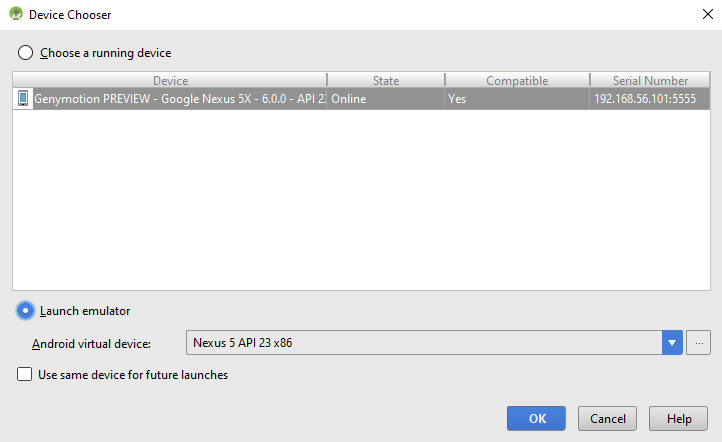
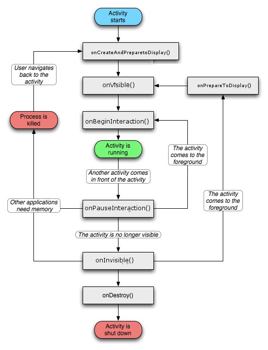
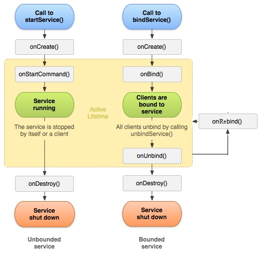

<!-- section start -->

<!-- attr: {id: 'title', class: 'slide-title', hasScriptWrapper: true} -->
# Android Application
<div class="signature">
    <p class="signature-course">Android Applications</p>
    <p class="signature-initiative">Telerik Software Academy</p>
    <a href="http://academy.telerik.com" class="signature-link">http://academy.telerik.com</a>
</div>


<!-- section start -->
<!-- attr: { id:'table-of-contents', class:'table-of-contents' } -->
# Table of Contents
- New Android Project
  - App architecture
  - Running it on Emulators and devices
  - Debugging
- App Manifest
- Application
  - Life-cycle
  - Context

<!-- attr: { showInPresentation:true } -->
<!-- # Table of Contents -->
- Activity
- Services
- Providers
- Adapters
- Fragments
- Loaders
- Receivers


<!-- section start -->
<!-- attr: { id:'', class:'slide-section', showInPresentation:true } -->
<!-- # New Android Project -->

# New Android Project
- [Directory Structure](https://developer.android.com/tools/projects/index.html)
- [Udacity course](https://www.udacity.com/course/progress#!/c-ud853)

- Minimum API - for Jan 2016
  - API 15: Android 4.0.3 (IceCreamSandwich) 
    - Currently can run on **96.2%** of devices
  - Create a new Blank Activity with Fragment
  - Wait for Gradle build to finish

<!-- attr: { style:'font-size:0.9em' } -->
# What's next
1. Add new Icon
  - Right-click on 'app'
  - New > Image asset
2. Run Emulator
  - Install HAXM (Hardware Accelerated Execution Manager) if needed
    - From SDK Manager
  - Go to `C:\Users\[your user name]\AppData\ Local\Android\sdk\extras\intel\ Hardware_Accelerated_Execution_Manager\`
  - Run `intelhaxm-android.exe`
    - May need to turn off Hyper-V from Windows Features

<!-- attr: { style:'font-size:0.9em' } -->
# Gradle
- Builds the Android Project
- Compiles the java code to binary
- Packages the project (APK)
  - Byte code, Resources, Manifest
- APK is then signed
- Installed on the device with ADB (Android debug bridge)
- For more details:
  - [Building with Gradle](http://developer.android.com/sdk/installing/studio-build.html?utm_source=udacity&utm_medium=mooc&utm_term=android&utm_content=studio_gradle&utm_campaign=training)
  - [Android Debug Bridge](http://developer.android.com/tools/help/adb.html?utm_source=udacity&utm_medium=mooc&utm_term=android&utm_content=adb&utm_campaign=training)

<!-- attr: { hasScriptWrapper:true } -->
# Running the app
- From the Menu `Run > Run 'app'`
  - Or `Run > Debug 'app'`
  - Or hit Green arrow/Bug on the action menu
- Should prompt you to choose a device



<!-- attr: { hasScriptWrapper:true } -->
# Debugging
- The Android SDK provides most of the tools that you need to debug your applications
- If you are using Android Studio, a JDWP-compliant debugger is already included and there is no setup required
- Android Debug Bridge ([adb](http://developer.android.com/tools/help/adb.html))
- More [info](http://developer.android.com/tools/debugging/index.html) on debugging


# Debugging from Android Studio
- Click Debug  in the toolbar
- On the Choose Device window, select a hardware device from the list or choose a virtual device
- Click OK. Your app starts on the selected device
- Using Dalvik Debug Monitor Server (DDMS)
  - Logcat view
  - Log levels
    - verbose, debug, info, warn, error, assert
- Breakpoints

# Use the System Log
- To write log messages in your code, use the `Log` class

```java
@Override
public void onCreate(Bundle savedInstanceState) {
    if (savedInstanceState != null) {
        Log.d(TAG, "onCreate() Restoring previous state");
        /* restore state */
    } else {
        Log.d(TAG, "onCreate() No saved state available");
        /* initialize app */
    }
}
```
- `Log.wtf()` - What a Terrible Failure

<!-- attr: { id:'', class:'slide-section demo', showInPresentation:true } -->
# Debugging
[Demo]()
 
<!-- section start -->
<!-- attr: { id:'', class:'slide-section', showInPresentation:true } -->
<!-- # Android Application
## Components and Life-cycle -->

# The Application
- Not much more than a container for your components
  - Activities
  - Services
  - Providers (Content providers)
  - Receivers
    - You need to register every one in the App Manifest

<!-- attr: { hasScriptWrapper:true } -->
# The Application Life-cycle


# Context
- Interface to global information about an application environment
- An abstract class whose implementation is provided by the Android system
- It allows access to
  - Application-specific resources and classes
  - Up-calls for application-level operations
    - Launching activities
    - Broadcasting
    - Receiving intents, etc.

<!-- attr: { style:'font-size:0.9em' } -->
# Activity
- Activity - represents a single screen of the UI
- When you start an application you actually start an Activity within that application
- As a developer you cannot control the state of the Activity
  - You can control what happens in a transition
    - By `@Override`-ing `onCreate()`, `onStart()`, etc.
- Only 1 activity may be in **running** state and many in **stoped** state
- In Android you cannot decide to **destroy** an activity
  - The device manages it's own memory

<!-- attr: { showInPresentation:true, hasScriptWrapper:true } -->
<!-- # Activity Life-cycle -->


<!-- attr: { hasScriptWrapper:true, style:'font-size:0.9em' } -->
# Services
- 'Background' process - has no UI
  - If the activity is **destroyed** the service continues to run
    - Eg. play music
- Used to check for new data on the net
- The developer controls the life of the service



# Content Providers
- Content Providers
  - Used when two apps need to share data
  - Contacts
  - MediaStore
  - Settings

# Adapters
- An Adapter object acts as a bridge between an `AdapterView` and the underlying data
  - Provides access to the data items
  - Makes a `View` for each item in the data set
- An intelligent way to connect large amount of data to a tiny screen
- Automatically figure out how to pull the 'next' when you scroll
- Efficient and scalable

# Fragment
- Activities can contain one or more Fragments
- Fragments are modular sections of an activity
  - Usually meant to display UI
  - Fragments are **Reusable UI**
- Two activities can have the same fragment and fragments can be added or removed from an Activity
- Introduced in Honeycomb
- Used through the `FragmentManager`

# Loaders
- Intelligent way to load data asynchronously
- Loading data form the net
  - May take time
  - The device may not have a connection (blocks the UI)
- Used through the `LoaderManager`

# Broadcast Receiver
- A dormant piece of code that is registered for some event in the future
  - Eg. battery low, boot completed, network
- An intent based publish-subscribe mechanism  
- Great for listening system events such as SMS messages
- Just implement `onReceive()`

# App Widgets
- 'Lives' outside of the app
  - Runs in another app as a guest
- Show on the home screen
- Similar as Broadcast Receiver as implementation
- Goes together with a meta-data file
  - Size, update period


<!-- section start -->
<!-- attr: { id:'questions', class:'slide-section', showInPresentation:true } -->
# Questions
<!-- ## Android Applications -->
[link to TelerikAcademy Forum]()
